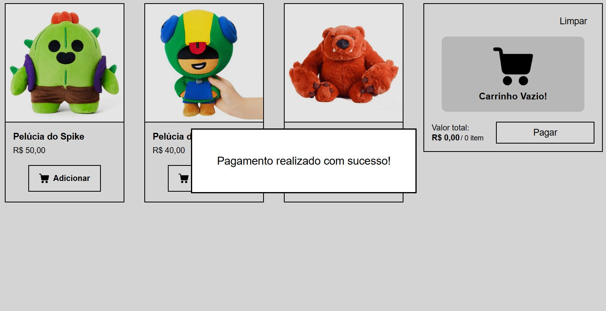

# Carrinho de compras com Javascript
### [Carrinho de Compras](https://devmathv.github.io/CarrinhoDeCompras_HTML_CSS_Javascript/) - GitHub Pages

## Descrição
Esse site tem a proposta de apresentar um modelo da seção de "carrinho de compras" de uma loja online. Desenvolvido com HTML, CSS e Javascript puros, esse site tem uma interface simples, porém uma lógica bem completa. O ponto principal dele foi o uso de Javascript para a lógica, manipulação de elementos DOM e uso de um array de objetos que simula um banco de dados para exibição de informações sobre os produtos.

## Funcionalidades Javascript
- **Exibição dos produtos**: O Javascript pega o template já pronto dos produtos no HTML e cria um novo produto baseado em informações de um array de objetos que simula um banco de dados. Permitindo fácil criação ou alteração de produtos.
- **Botão de "adicionar ao carrinho":** Adiciona o produto ao carrinho e aumenta em 1 a quantidade do item se já existir.
- **Mensagem "Carrinho Vazio!":** Verifica automaticamente se há produtos no carrinho e exibe a mensagem caso não houver.
- **Produtos no carrinho:** Esses produtos são criados com base em um template no HTML e do array de objetos. Informações como quantidade e valor total são armazenadas em um outro array de objetos, permitindo fácil manipulação.
- **Diminuir e aumentar quantidade:** Botões que permitem alterar a quantidade dos produtos. Altera também o valor total do produto. Caso a quantidade vire **0**, o produto é removido automaticamente do carrinho.
- **Botão "Limpar":** Remove todos os itens do carrinho.
- **Valor e quantidade total:** Esses valores são exibidos automaticamente após qualquer alteração em algum produto do carrinho.
- **Botão "Pagar":** Exibe uma mensagem dizendo que o pagamento foi realizado e deixa o carrinho vazio. Caso não tenha produtos, ele exibe uma mensagem dizendo que é necessário adicionar algum produto.

## Tecnologias
- **HTML:** Estrutura do site
- **CSS:** Estilização do site
- **Javascript:** Estruturação do site, estilização, lógica e funcionalidades do site

## Imagens

### Produtos no carrinho

### Pagamento
